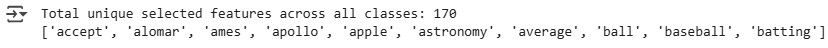
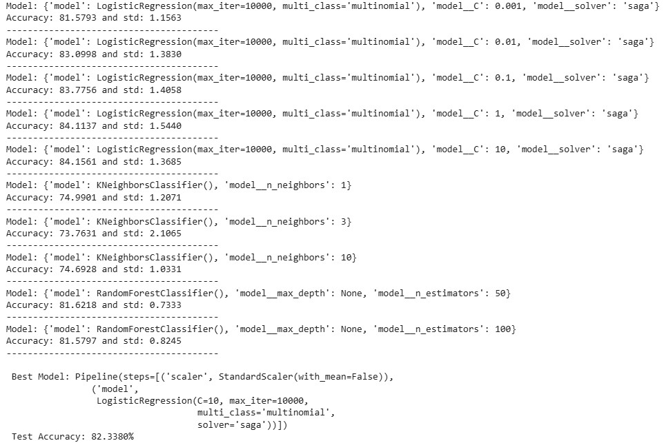
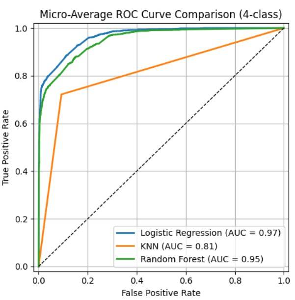

# Mcgill_COMP551_Applied_ML_20Newsgroups_Dataset
The projects of Applied Machine Learning (COMP 551) at Mcgill University; Classification using Multiclass Logistic Regression, K-Nearest Neighbors (KNN), and Random Forest evaluated by ROC on 20 Newsgroups Dataset

# 20 Newsgroups Text Classification
This repository presents a complete pipeline for multiclass text classification using the 20 Newsgroups dataset. The dataset consists of newsgroup posts categorized into 20 distinct topics from which four topics are selected. This project implements and compares Multiclass Logistic Regression, K-Nearest Neighbors (KNN), and Random Forest classifiers to evaluate their effectiveness on high-dimensional text data.

# Dataset
The 20 Newsgroups dataset is a popular collection of approximately 20,000 newsgroup documents evenly categorized into 20 different topics. It is available through: sklearn.datasets.fetch_20newsgroups

# Project Structure
The project is structured into three key tasks:

🧹 **Task 1: Data Preprocessing**

- Importing the 20 Newsgroups dataset
- Text cleaning
- Vectorization: converting text into numerical format
- Feature importance estimation using Mutual Information (MI)
- Splitting into training and testing sets

🤖 **Task 2: Model Implementation**
Implementing and tuning the following models:
1. Multiclass Logistic Regression
2. K-Nearest Neighbors (KNN)
3. Random Forest Classifier
4. Utilizing pipelines and cross-validation for model optimization

📈 **Task 3: Prediction & Evaluation**

- Generating predictions on the test data
- Evaluating models using multiclass ROC curves

## 📊 Illustrations

### 📝 Word Counts After Masking

---

### 🧬 Feature Importance using Mutual Information

---

### ⚙️ Model Optimization Using Pipelines

---

### ⚙️ Model Performance Evaluation
Comparison of ROC curves across classifiers:

Please explore the notebook for more!